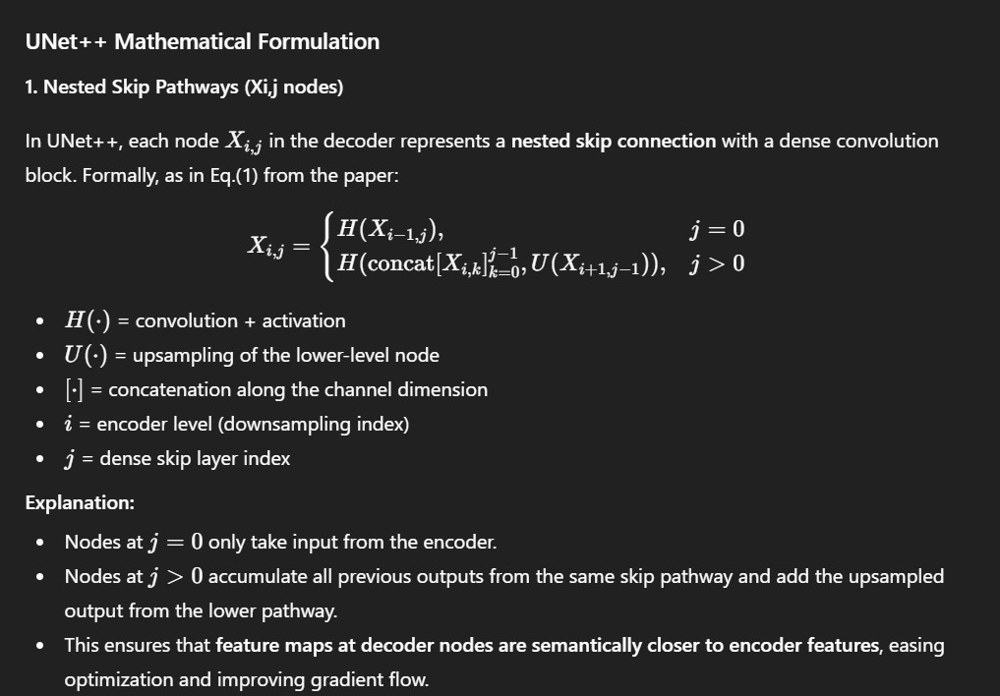

# 🌱 UNet++‑Replication

This repository contains a PyTorch implementation of **UNet++**, designed to replicate the nested skip‑path architecture and deep supervision strategy for semantic segmentation tasks.  

- Implements full **nested skip pathways** with **dense convolution blocks** (as described in Eq.(1) of the paper).  
- Supports **deep supervision**: segmentation heads on multiple decoder levels for flexible training / pruning.  
- Pure architecture-level code, so you can plug in your own data loader & loss / training loop.  

---

## 🖼️ Overview – UNet++ Architecture

  
*Figure 2:* Qualitative comparison between **U-Net**, **wide U-Net**, and **UNet++**, showing segmentation results for **polyp**, **liver**, and **cell nuclei** datasets (2D-only for clear visualization).  

>UNet++ is a nested U-Net for semantic segmentation. Dense skip pathways connect encoder and decoder nodes, reducing the semantic gap and improving feature alignment. Deep >supervision allows outputs at multiple decoder levels for flexible training or faster inference.

  
*Mathematical formulation:* Eq.(1) defines how each node combines features from encoder or lower‑level upsampled maps; deep supervision at multiple depths uses combined BCE + Dice loss.  

---

## 🏗️ Repo Structure

```text
UNet++-Replication/
│
├── src/
│   ├── layers/
│   │   ├── conv_layer.py               # Basic conv + BN + activation blocks  
│   │   ├── dense_skip_block.py         # Dense convolution block along skip pathways  
│   │   ├── upsample_layer.py           # Upsampling operations for decoder / skip connections  
│   │   ├── deep_supervision_head.py    # 1×1 conv + activation producing segmentation outputs at multiple depths  
│   ├── blocks/
│   │   ├── encoder_block.py            # Encoder stage: convs + down‑sampling  
│   │   ├── decoder_block.py            # Decoder stage (non‑nested paths)  
│   │   └── nested_skip_unit.py         # Implements node computation \(X_{i,j}\) according to Eq.(1)  
│   ├── model/
│   │   └── unetpp_model.py             # High‑level UNet++ model assembly: encoder, nested skips, decoder, deep supervision heads  
│   └── config.py                       # Default hyperparameters: input channels, depth, base filters, etc.  
│
├── images/
│   ├── figuremix.jpg                     
│   │                   
│   └── math.jpg                        # key equations and mathematical overview  
├── requirements.txt                    # minimal dependencies  
└── README.md                           # this file  
```
---


## 🔗 Feedback

For questions or feedback, contact: [barkin.adiguzel@gmail.com](mailto:barkin.adiguzel@gmail.com)
